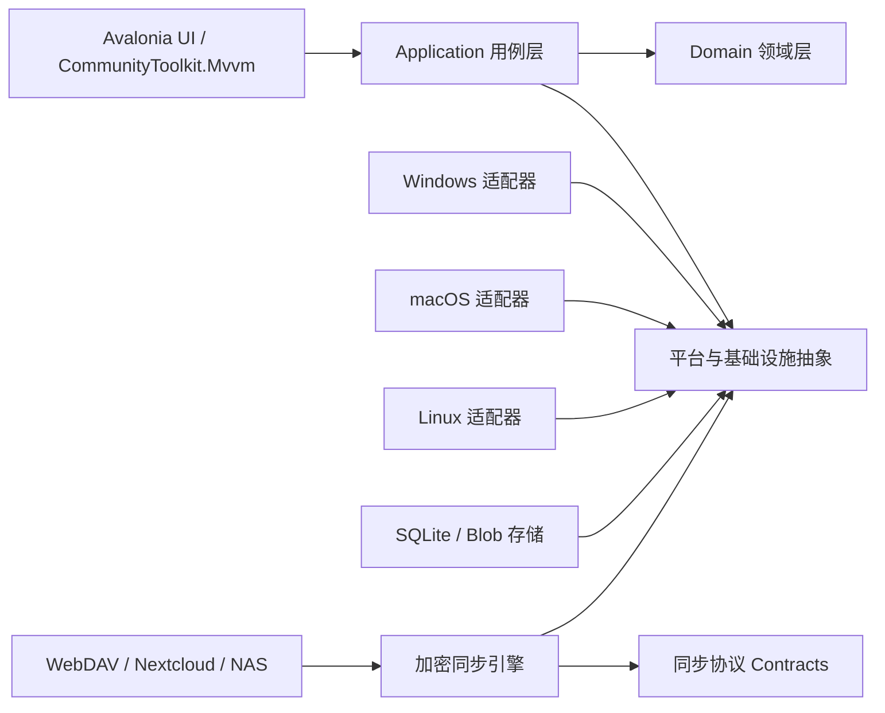

# SnapBoard（闪剪）跨平台剪贴板管理器项目计划

> 文档状态：已批准，进入执行
> 制定日期：2026-07-26
> 批准日期：2026-07-26
> 当前阶段：快速窗口双击快捷键与全屏保护的阶段 B 已完成 macOS 原生实现、纯修饰键修复、自动验证和当前 Apple Silicon 环境内的窗口/AOT/应用内按钮验证；完成定义仍缺物理键盘长按、物理多显示器和 Retina 证据；Linux CI 因 Skia 原生依赖暂时注释，未将 Linux 标记为已验证
> 实现状态：Windows 保持既有共享两槽快捷键、双击状态机、前台检测和可组合暂停行为；macOS 已接入两个 Carbon Hot Key ID、modifier-only 状态变化边界、NSUserDefaults 当前格式、五态前台窗口检测、共享快捷键控制器、记录前置保护和分离状态文案，不读取开发期快捷键格式，也不使用全局键盘 Hook、Screen Recording 或窗口标题进行判定
> 本次目标口径：实施 `docs/QUICK_WINDOW_SHORTCUT_AND_FULLSCREEN_REQUIREMENTS.md` 第 13.4 节阶段 B；代码与当前可用环境验证已完成，但整个跨平台功能保持部分完成，不能用单显示器非 Retina 与合成输入结果外推尚缺的真实硬件/物理输入验收
> 总体顺序：Windows -> macOS -> Linux

## 1. 项目目标

实现一款用户可见名称为“闪剪”、内部英文标识为 `SnapBoard` 的跨平台桌面剪贴板管理器。产品借鉴 Ditto 的核心工作流，具备高性能历史记录、快速检索、键盘优先操作、多设备同步和隐私保护能力。

项目需要同时满足以下核心约束：

- 客户端使用 .NET 10、Avalonia 12、CommunityToolkit.Mvvm。
- Ursa.Avalonia 作为可选 UI 控件库，只有在 AOT、内存和启动性能验证通过后才保留。
- 本地持久化直接使用 Microsoft.Data.Sqlite、参数化 SQL 和 FTS5，不引入运行时反射型 ORM。
- Windows、macOS、Linux 的系统能力全部通过平台接口隔离，业务层不得直接依赖原生 API。
- Native AOT 从第一期第一批代码开始持续验证，不作为项目末期优化项。
- 托盘常驻实际运行内存目标低于 100 MB，并建立可重复的测量方法和发布门槛。
- UI、磁盘、图片处理和网络同步之间必须异步解耦，任何磁盘或网络 I/O 不得阻塞 UI 线程。
- 主要架构边界、原生 API、并发流程、加密和同步代码使用详细中文注释；普通属性和显而易见的代码不堆砌注释。

## 2. 当前已确认的技术基线

以下版本是 2026-07-26 调研时的最新稳定版本。项目开始实现时仍需再次检查，并通过中央包管理锁定实际使用版本。

| 组件 | 当前稳定版本 | 规划结论 |
| --- | --- | --- |
| .NET SDK | 10.0.302 | 已安装并由 `global.json` 锁定 |
| .NET Runtime | 10.0.10 | 使用 .NET 10 LTS 最新安全补丁 |
| Avalonia | 12.1.0 | 客户端 UI 基础框架 |
| Avalonia.Templates | 12.1.0.2 | 仅用于初始化工程，生成后由仓库配置接管 |
| CommunityToolkit.Mvvm | 8.4.2 | ViewModel、命令、消息和属性通知 |
| Irihi.Ursa | 2.1.0 | 兼容 Avalonia 12.0.2 以上，需通过性能门槛 |
| Irihi.Ursa.Themes.Semi | 2.1.0 | 可选主题，需与纯 Avalonia 基线做 A/B 测试 |
| Material.Icons.Avalonia | 3.0.2 | 当前命令中心图标库；已通过 macOS arm64 Native AOT |
| Microsoft.Data.Sqlite | 10.0.10 | 默认且唯一的数据访问 Provider，使用参数化 SQL 和显式映射 |
| SQLitePCLRaw.bundle_e_sqlite3 | 2.1.12 | 显式覆盖 2.1.11，确保 SQLite 版本包含 CVE-2025-6965 修复 |
| BitMiracle.LibTiff.NET | 2.4.660 | Skia 不支持 TIFF 解码；仅在 Infrastructure 后台受限解码 TIFF 缩略图，原图字节保持不变 |
| System.Text.Json | .NET 10 内置 | 同步协议使用源生成上下文；禁止 Newtonsoft.Json 和反射序列化 |
| SqlSugar | 5.1.4.216 / AOT 5.1.4.186 | 已实测但不采用；不能满足零 AOT 警告和最小依赖图 |
| EF Core / SQLite | 10.0.10 | 不采用；微软目前仍将 EF NativeAOT 查询预编译标记为高度实验性 |
| BenchmarkDotNet | 0.15.8 | 微基准和关键路径性能验证 |

### 2.1 数据访问结论

确定采用以下组合：

```text
Microsoft.Data.Sqlite 10.0.10
  + SQLitePCLRaw.bundle_e_sqlite3 2.1.12
  + 参数化 SQL / 显式映射 / SQLite FTS5
```

选择依据：

- `SqlSugarCoreNoDrive 5.1.4.216` 普通构建可用，但配合官方要求的整程序集 `rd.xml` 发布 Native AOT 时会解析未携带的 MySQL 等驱动并失败。
- `SqlSugarCoreNoDrive.Aot 5.1.4.186` 携带 SQL Server、MySQL、PostgreSQL 等本项目无关依赖，实测产生 IL2104、IL3053、IL3000 等裁剪和 AOT 分析错误。
- 压制这些警告会隐藏真实兼容风险，也会破坏“零 AOT 警告”和低内存目标，因此 SqlSugar 不进入正式依赖图。
- EF Core 10.0.10 虽然可以发布 Native AOT，但微软官方仍将其查询预编译能力标为高度实验性且不建议生产使用，因此本项目不选 EF Core。
- SnapBoard 的查询规模和模型边界适合显式 SQL；直接 Provider 能更精确地控制投影字段、连接生命周期、FTS5、WAL 和内存分配。

数据访问约束：

- 所有 SQL 使用参数，禁止拼接用户输入、剪贴板正文、路径或搜索条件。
- 连接由工厂创建并短生命周期使用；单写 `Channel<T>` 串行处理写事务。
- 列表查询使用显式投影和手工映射，只读取当前页面需要的字段。
- 迁移脚本、PRAGMA、WAL 和 FTS5 语句集中版本化，禁止散落在 ViewModel 或平台项目中。
- 仓储接口隔离 `Microsoft.Data.Sqlite` 类型，UI、Application 和 Domain 层不得直接引用 Provider。
- `SQLitePCLRaw.bundle_e_sqlite3` 固定为已修复版本，并由自动测试执行 `sqlite_version()` 安全下限检查。
- 每个平台第一次 AOT 发布时运行 CRUD、事务、分页、FTS5 和迁移冒烟测试。

同步 JSON 约束：

- 仅使用 .NET 内置 `System.Text.Json`。
- 协议 DTO 必须登记到 `JsonSerializerContext` 源生成上下文。
- 禁止在同步、配置和持久化代码中引入 Newtonsoft.Json。
- 禁止调用依赖运行时反射发现任意类型的序列化重载。

## 3. 产品决策

### 3.1 已确认

| 决策 | 结论 |
| --- | --- |
| 内部英文标识 | `SnapBoard`，用于源码、程序集、可执行文件、数据路径和协议兼容标识 |
| 用户可见应用名 | `闪剪`，窗口标题、品牌区、托盘/菜单栏、Windows 产品元数据和 macOS Display Name 不再显示英文标识 |
| 根命名空间 | `SnapBoard` |
| 许可证 | MIT |
| 源码托管 | [GitHub - wuliangtdi/SnapBoard](https://github.com/wuliangtdi/SnapBoard) |
| 构建与发布 | GitHub Actions 在对应操作系统 Runner 构建 Native AOT，并上传 GitHub Releases |
| 第一种同步后端 | WebDAV，兼容用户自建服务、Nextcloud 和 NAS |
| Windows 验收环境 | 已有 Windows 11 测试环境 |
| 首版同步内容 | 文本、HTML、RTF、图片；不同步文件本体 |
| 本地数据库加密 | 先完成 SQLCipher/AOT 性能验证，通过后再决定是否默认启用 |
| GNOME Wayland | 接受配套 Shell 扩展或功能受限模式，并明确标注支持等级 |

源码仓库已确定为 `wuliangtdi/SnapBoard`，macOS Bundle Identifier 固定为 `com.wuliangtdi.snapboard`。Developer ID Application/Installer 身份、签名团队和公证凭据仍需在正式发布环境配置。

### 3.2 已确认的实施边界

| 决策 | 已确认方案 | 影响 |
| --- | --- | --- |
| 首版同步内容 | 文本、HTML、RTF、图片；文件内容不同步 | 文件本体同步涉及带宽、配额、病毒扫描和大文件续传 |
| 本地数据库加密 | 先做 SQLCipher/AOT 性能验证，再决定是否默认启用 | 加密数据库有利于隐私，但会增加原生依赖和发布复杂度 |
| GNOME Wayland 支持方式 | 接受配套 Shell 扩展或受限模式 | Wayland 不允许普通应用统一监听全局剪贴板 |

## 4. 范围定义

### 4.1 核心功能

- 监听系统剪贴板变化并保存历史。
- 支持纯文本、HTML、RTF、图片、文件引用和平台自定义格式元数据。
- 按内容、来源应用、类型、时间、标签和置顶状态检索。
- 全局快捷键打开快速粘贴窗口。
- 完整键盘导航、数字快捷选择、纯文本粘贴和普通粘贴。
- 系统托盘常驻、单实例、开机启动和后台更新。
- 去重、保留策略、容量限制、应用黑名单和敏感格式过滤。
- Windows 到 Windows 的 WebDAV 加密同步在第一期落地，后续平台复用同一协议。
- 多设备离线队列、增量同步、冲突处理、删除同步和设备撤销。
- 默认端到端加密，WebDAV 服务端和存储提供方不接触剪贴板明文。

### 4.2 首个正式版本不包含

- 文件本体跨设备传输。
- OCR、AI 分类或内容改写。
- 任意脚本和插件执行。
- 团队共享空间和组织管理。
- 浏览器、Android 和 iOS 客户端。
- 云端全文搜索。

这些功能必须建立在稳定的本地核心和同步协议之上，不能提前污染第一期架构。

## 5. 总体架构



### 5.1 计划中的解决方案结构

```text
src/
  SnapBoard.Desktop/
  SnapBoard.Domain/
  SnapBoard.Application/
  SnapBoard.Infrastructure/
  SnapBoard.Platform.Abstractions/
  SnapBoard.Platform.Windows/
  SnapBoard.Platform.MacOS/
  SnapBoard.Platform.Linux/
  SnapBoard.Sync.Contracts/
  SnapBoard.Sync.WebDav/
tests/
  SnapBoard.Domain.Tests/
  SnapBoard.Application.Tests/
  SnapBoard.Infrastructure.Tests/
  SnapBoard.Platform.Windows.Tests/
  SnapBoard.Platform.MacOS.Tests/
  SnapBoard.Platform.Linux.Tests/
  SnapBoard.Sync.WebDav.Tests/
  SnapBoard.Desktop.HeadlessTests/
  SnapBoard.Architecture.Tests/
  SnapBoard.PerformanceTests/
docs/
  PLAN.md
  PROGRESS.md
  REQUIREMENTS.md
  ARCHITECTURE.md
  PERFORMANCE.md
  SECURITY.md
  TESTING.md
  PLATFORM_MATRIX.md
  SYNC_PROTOCOL.md
  UI_GUIDELINES.md
  adr/
```

项目数量将在骨架阶段复核。原则是边界清晰，但不为了形式制造只有几个类型的空程序集。

### 5.2 依赖方向

- `Domain` 不引用 UI、数据库、网络或任何平台项目。
- `Application` 只引用 `Domain` 和抽象接口。
- `Infrastructure` 实现存储、同步队列、加密和配置接口。
- `Platform.*` 只实现操作系统能力，不承载业务规则。
- `Desktop` 是组合根，负责 DI、窗口、ViewModel、主题和生命周期。
- `Sync.Contracts` 只包含协议 DTO、版本和序列化上下文。
- `Sync.WebDav` 只实现远程对象的枚举、读取、条件写入和删除，不承载领域冲突规则。
- ViewModel 不直接执行 SQL、P/Invoke、文件 I/O 或网络请求。

## 6. 关键责任链

### 6.1 剪贴板采集链

```text
系统剪贴板变化事件
  -> IClipboardMonitor
  -> 读取序列号和可用格式
  -> IClipboardContentReader
  -> 内容标准化与大小检查
  -> 过滤责任链
       1. 本应用写入抑制
       2. 临时/敏感格式过滤
       3. 应用黑名单
       4. 内容类型开关
       5. 最大容量限制
  -> 内容哈希与相邻重复合并
  -> 持久化事务
  -> FTS 索引更新
  -> 同步 Outbox 写入
  -> UI 增量通知
```

实现要求：

- 系统事件回调只采集最少信息并快速返回。
- 使用有界 `Channel<T>` 串行处理写入，避免暴发式复制导致无限排队。
- 剪贴板被其他进程占用时采用短周期、有上限的重试，不阻塞消息循环。
- 每个事件保留平台剪贴板序列号，避免重复读取和反馈循环。
- 大图片采用流式读取和后台缩略图生成，不把原始图像常驻内存。

### 6.2 快速粘贴链

```text
全局快捷键
  -> 记录当前目标窗口
  -> 打开当前显示器上的快速窗口
  -> 分页搜索本地索引
  -> 用户选择记录
  -> 写入系统剪贴板并加本应用来源标记
  -> 关闭快速窗口
  -> 恢复目标窗口焦点
  -> 平台允许时注入粘贴快捷键
  -> 更新使用次数和最近使用时间
```

平台限制：Windows 可通过 Win32 完成自动粘贴，但对管理员权限更高的目标进程存在 UIPI 限制；macOS 需要辅助功能权限；Wayland 下自动按键注入不一定可用，必须提供“复制后由用户粘贴”的降级模式。

### 6.3 同步链

```text
本地变更
  -> SyncOutbox
  -> 规范化协议事件
  -> 按设备和大小组成不可变事件分片
  -> 压缩
  -> 端到端加密
  -> WebDAV PUT 条件写入
  -> 其他设备通过 PROPFIND 枚举新分片
  -> GET 下载尚未处理的分片
  -> 解密、校验和幂等合并
  -> 本地持久化和 UI 通知
```

WebDAV 没有统一的实时推送机制，因此同步由四类事件触发：本地变化后的短延迟批处理、可配置的周期检查、应用启动或系统唤醒、网络恢复或用户手动同步。目标默认延迟为数秒到数十秒，不承诺即时推送。

严禁直接把 `snapboard.db` 或 WAL 文件上传到 WebDAV。远端只保存不可变的加密事件分片、加密 Blob 和设备状态文件，避免多设备同时写同一个 SQLite 文件造成冲突或数据库损坏。

## 7. 本地数据设计

### 7.1 主要实体

- `ClipboardItem`：逻辑历史记录、时间、来源、类型、置顶、删除和同步状态。
- `ClipboardRepresentation`：同一记录的 Text、HTML、RTF、Bitmap、File 等表示。
- `ContentBlob`：内容寻址的大对象，保存图片或较大载荷，支持引用计数和去重。
- `ClipboardTag` / `ClipboardItemTag`：标签和关联。
- `SyncOutbox`：尚未确认上传的本地事件。
- `SyncCursor`：本机针对每个远端设备的最后已处理序列号。
- `Device`：设备身份、公钥、撤销状态和最后活动时间。
- `AppRule`：按来源应用配置的忽略、仅文本或容量策略。
- `Setting`：版本化设置，不把任意对象直接序列化进数据库。

### 7.2 存储策略

- SQLite 使用 WAL 模式、合理的 busy timeout、外键和明确索引。
- 所有写入通过单写队列执行，读取使用独立短生命周期连接。
- 列表查询只取预览字段，不读取完整图片和富文本载荷。
- 大载荷保存在内容寻址 Blob 目录，数据库保存哈希、大小、MIME 和相对路径。
- Blob 写入采用临时文件、落盘刷新、原子重命名和数据库事务；数据库只保存哈希、大小、MIME、引用计数和相对路径，不长期保存原始图片。
- 孤儿扫描在数据库初始化完成两分钟后进入后台，使用 24 小时宽限和 32 文件批次；删除前必须在单写队列内按完整相对路径复查数据库引用，绝不根据文件名或哈希前缀猜测共享关系。
- 文本检索评估 FTS5 `unicode61` 和 `trigram`，必须覆盖中文、英文和代码片段。
- 相邻相同内容默认合并并更新时间；置顶记录和用户主动创建的片段不自动合并。
- 保留策略同时支持最大条数、最大天数和最大磁盘占用，置顶内容默认豁免。

开源实现复核：CopyQ 默认把超过 1 KiB 的 item data 写入加盐 SHA-256 分片目录，使用 `QSaveFile` 原子提交，并用 120 秒单次计时器清理未引用文件；EcoPaste 按 PNG 字节 BLAKE3 把原图和懒生成缩略图写入分片目录。Ditto 的 `Data.ooData` 直接使用 SQLite `BLOB`，当前 Maccy SwiftData 模型也直接持有 `Data?`，但只缓存按需解码的 `NSImage`。SnapBoard 面向大图、共享内容和后续同步，采用“SQLite 小文本/元数据 + 外部 CAS 大对象”的折中，并比这些参考实现增加显式引用计数、事务失败回滚、24 小时宽限和删除前精确路径复查。参考：[CopyQ 存储源码](https://github.com/hluk/CopyQ/blob/0ae121f750dcadd28beba4207f320487872dd317/src/item/serialize.cpp)、[EcoPaste 图片存储](https://github.com/EcoPasteHub/EcoPaste/blob/6dbbf4f1b50eae24b1ae2c4a46adce3424d9c597/src-tauri/src/clipboard/storage.rs)、[Ditto Schema](https://github.com/sabrogden/Ditto/blob/d36f864f9e6bc3558e11e3f1c9f5f522b8079702/src/DatabaseUtilities.cpp)、[Maccy 内容模型](https://github.com/p0deje/Maccy/blob/6fcb54e602370aa4b015d8c5ce7e8521973d318b/Maccy/Models/HistoryItemContent.swift)。

## 8. Native AOT 设计约束

Native AOT 是客户端正式发布路径，JIT 构建只用于快速开发和诊断。

### 8.1 编码约束

- 主程序发布配置启用 `PublishAot`。
- 自有库逐个启用 `IsAotCompatible`，测试项目除外。
- AOT 和裁剪警告必须在 CI 中视为失败，不允许长期使用警告抑制绕过问题。
- Avalonia XAML 全部使用编译绑定并声明 `x:DataType`。
- 不使用依赖运行时扫描的 ViewLocator；View 与 ViewModel 使用显式注册映射。
- JSON 使用 `System.Text.Json` 源生成上下文，不使用运行时反射序列化。
- 原生互操作优先使用源生成的 `LibraryImport`，明确字符集和调用约定。
- 不使用动态代理、运行时 IL 生成、插件程序集扫描或基于字符串的类型激活。
- DI 使用显式注册，禁止扫描全部程序集自动注册服务。
- 反射只允许用于已经验证可裁剪且具有完整注解的有限场景。

### 8.2 AOT 发布矩阵

- Windows：`win-x64`，后续评估 `win-arm64`。
- macOS：`osx-arm64` 和 `osx-x64`，发布时组合通用应用或分别提供安装包。
- Linux：`linux-x64` 和 `linux-arm64`。
- Native AOT 不能跨操作系统编译，因此 CI 必须使用对应操作系统的构建节点。
- 每个平台适配器首次合入时就必须完成该平台 AOT 冒烟测试。

### 8.3 GitHub Actions 构建与发布

- 普通提交和 Pull Request 运行格式检查、构建、单元测试、架构测试和短基准。
- Windows Job 在 Windows Runner 构建并测试 `win-x64` Native AOT。
- macOS Job 在 macOS Runner 分别构建 `osx-arm64`、`osx-x64`，签名和公证只在发布标签执行。
- Linux Job 在 Ubuntu Runner 构建 `linux-x64`；`linux-arm64` 使用原生 arm64 Runner 或经过验证的构建节点。
- Git 标签采用语义化版本，例如 `v0.1.0`。标签工作流创建 GitHub Release 并上传各平台安装包、便携包、校验和与 SBOM。
- Windows 签名证书、Apple Developer 凭据和公证密钥只保存在 GitHub Actions Secrets 或受保护环境中。
- 未签名的开发构建必须明确标识，不能与正式 Release 混淆。
- 构建产物由 Actions 生成，不在 Git 仓库中提交二进制文件。

### 8.4 依赖准入门槛

新增第三方依赖必须记录：

- 是否公开声明 AOT/裁剪兼容。
- AOT 发布是否产生 IL2026、IL3050 等警告。
- 对空闲运行内存和冷启动的增量。
- 是否引入不需要的原生库或数据库驱动。
- 许可证是否允许目标发布方式。

Ursa 属于“验证通过才采用”的 UI 增强依赖。SqlSugar 和 EF Core 已经完成准入评估但未通过硬门槛；除非新的稳定版本能够零警告通过完整 AOT、内存和功能测试，否则不重新引入。

## 9. 性能与运行内存预算

### 9.1 统一测试数据集

- 100,000 条文本历史，平均正文 500 字符。
- 2,000 条 HTML/RTF 记录。
- 1,000 张图片，原图 0.5 MB 到 10 MB，列表仅加载缩略图。
- 10,000 次连续剪贴板变更压力测试。
- 中文、英文、路径、URL、JSON、代码和长文本混合搜索。

### 9.2 预算和发布门槛

| 指标 | 目标 | 发布失败条件 |
| --- | --- | --- |
| 托盘常驻、窗口关闭、稳定 10 分钟 | <= 80 MB | > 100 MB |
| 快速窗口打开、100 个文本项可见 | <= 100 MB | > 120 MB |
| 图片预览关闭 30 秒后 | 回落到 <= 100 MB | 持续增长或无法回落 |
| 空闲 CPU | 平均 < 0.3% | 持续 > 1% |
| 快速窗口暖启动 P95 | < 120 ms | > 250 ms |
| 文本采集到可检索 P95 | < 100 ms | > 250 ms |
| 100,000 条记录搜索 P95 | < 80 ms | > 200 ms |
| 列表滚动 | 60 FPS，单帧 < 16.7 ms | 明显掉帧或 UI 线程长任务 |
| 8 小时、10,000 次事件稳定性 | 稳定内存增长 < 8 MB | 持续泄漏或句柄增长 |
| Native AOT 发布 | 0 个未解释 AOT/裁剪警告 | 任一平台无法发布或关键功能失效 |

不同操作系统使用不同的内存指标：

- Windows：Private Working Set 和 Private Bytes。
- macOS：Physical Footprint。
- Linux：PSS，读取 `/proc/<pid>/smaps_rollup` 或使用同等工具。

最终发布报告必须同时给出测量工具、测试机器、构建 RID、运行时长和样本数据，不能只截取任务管理器瞬时数值。

### 9.3 性能实现原则

- 快速窗口只保留当前页和少量预取数据，不把全部历史放进 `ObservableCollection`。
- 列表必须虚拟化，Item 模板避免深层嵌套和昂贵效果。
- 图片仅按目标尺寸解码，缩略图缓存设置严格的条目数和字节上限。
- 使用 `ArrayPool<byte>`、流和有界缓冲区处理大载荷。
- 数据库、哈希、压缩、图片解码和网络全部在后台线程执行。
- UI 事件合并后批量通知，避免复制高峰触发大量细碎布局。
- 日志默认异步且有滚动上限，不在发布构建记录剪贴板正文。
- 空闲状态不使用高频轮询；macOS 必须通过基准选择合理的 `changeCount` 检查周期。
- 原生句柄、Bitmap、Stream、数据库连接和取消令牌必须明确释放。

### 9.4 首批 A/B 基准

骨架建立后先完成三个空壳程序对比，不进入业务开发：

1. 纯 Avalonia Fluent 空窗口和托盘。
2. Avalonia + Ursa/Semi 空窗口和托盘。
3. 最终快速窗口壳、DI、日志、SQLite 连接和平台服务空实现。

数据层基准直接使用 `Microsoft.Data.Sqlite`，覆盖连接池、参数化查询、事务、分页、FTS5、迁移和手工映射。后续只有在重复映射成为经过测量的主要维护成本时，才评估兼容 Native AOT 的编译期代码生成方案。

## 10. UI 与交互方向

UI 定位是安静、紧凑、键盘优先的效率工具，不采用营销页、大面积装饰、卡片套卡片或影响扫描效率的视觉效果。

### 10.1 参考项目

- Ditto：快速粘贴、数字选择、置顶和 Windows 工作流。
- Maccy：轻量命令面板、搜索优先、键盘导航。
- CopyQ：类型处理、过滤、标签、分组和高级历史管理。
- PasteBar：内容预览、收藏和组织方式。

只借鉴交互模式和信息层级，不直接复制受许可证保护的图标、主题代码、截图或品牌资源。

### 10.2 快速窗口初步布局

```text
┌─────────────────────────────────────────────────────────┐
│ 搜索历史...                           类型  设备  设置   │
├─────────────────────────────────────────────────────────┤
│ 1  [文本]  内容预览第一行                    2 分钟前  ☆ │
│ 2  [代码]  using System...                  10 分钟前  ★ │
│ 3  [图片]  3200 x 1800                     昨天       ☆ │
│ 4  [HTML]  页面标题和纯文本摘要              2 天前     ☆ │
├─────────────────────────────────────────────────────────┤
│ 100,000 条历史      Enter 粘贴     Shift+Enter 纯文本   │
└─────────────────────────────────────────────────────────┘
```

### 10.3 主要交互

- 默认焦点始终在搜索框，输入即过滤。
- 上下方向键移动，Enter 粘贴，Shift+Enter 纯文本粘贴。
- 1 到 9 可快速选择当前结果。
- Escape 立即关闭且恢复原窗口焦点。
- 右侧预览按需加载，默认不解码大图片。
- 设置窗口与快速窗口分离，快速窗口不承载复杂配置。
- 中文和英文资源从第一期开始分离，避免后期硬编码文本迁移。
- 所有图标使用统一图标库或 Ursa 内置资源，不手绘不一致的 SVG。

## 11. 同步与安全方案

### 11.1 WebDAV 远端布局

```text
/SnapBoard/v1/<space-id>/
  space.json.enc
  devices/
    <device-id>/
      profile.json.enc
      events/
        <sequence>-<ulid>.segment.enc
      checkpoints/
        <sequence>.checkpoint.enc
  blobs/
    <prefix>/<keyed-content-hash>.blob.enc
```

- 每台设备只写自己的 `devices/<device-id>` 目录，避免多个设备覆盖同一个可变清单。
- 事件文件和 Blob 一经成功上传便不可修改；新状态通过新事件表达。
- 使用 `MKCOL` 创建目录，`PROPFIND Depth: 1` 枚举对象，`GET` 下载，`PUT` 上传。
- 新对象上传使用 `If-None-Match: *`，已有可变状态更新必须结合 ETag 和 `If-Match`，避免丢失更新。
- 不依赖所有服务端都正确实现 WebDAV `LOCK`，核心正确性由设备独占目录、不可变对象和条件请求保证。
- WebDAV 凭据与同步内容加密密钥完全分离。更换 WebDAV 密码不应改变内容密钥。

### 11.2 同步协议与冲突

- 记录 ID 使用可排序的全局唯一 ID，具体采用 ULID 或 UUIDv7，在 ADR 中确定。
- 客户端所有写操作先落本地 Outbox，离线时不丢失。
- 事件先批量、压缩、加密，再生成不可变分片，降低大量小文件和网络请求成本。
- 每个设备维护其他设备的最后已处理序列号，重复下载和重复应用必须幂等。
- 删除使用 Tombstone，避免离线设备重新上传已删除内容。
- 剪贴板内容按追加事件处理；置顶、标签和删除使用逻辑时钟、版本号及确定性的 LWW 规则。
- 二进制内容与事件元数据分离，Blob 使用密钥化内容哈希命名，实现加密条件下去重。
- 定期生成加密 Checkpoint，避免新设备必须回放无限历史事件。
- 远端清理必须保守执行。第一版宁可保留旧分片，也不能在设备尚未确认前删除唯一数据。
- WebDAV 不提供统一推送，默认使用短延迟上传和 10 到 30 秒可配置拉取周期，并在启动、唤醒、网络恢复时立即检查。

### 11.3 端到端加密

- 每个同步空间生成独立主密钥，WebDAV 服务端不保存明文主密钥。
- 设备通过二维码、恢复码或已有设备批准获得加密后的主密钥。
- 每个事件分片和 Blob 使用带认证的加密算法，并将协议版本、SpaceId、DeviceId、序列号作为附加认证数据。
- 密钥保存在 Windows DPAPI/Credential Locker、macOS Keychain、Linux Secret Service/KWallet 适配层中。
- WebDAV URL、用户名和应用密码同样放入操作系统凭据存储，不写入普通配置文件或日志。
- 默认只允许 HTTPS。自签名证书通过明确的证书指纹固定处理，禁止提供“忽略所有证书错误”开关。
- 设备撤销和主密钥轮换需要在协议中预留版本；历史密文的完全前向保密属于后续增强。
- 不自行发明加密算法。实现前对 .NET 内置密码学和成熟库进行 AOT、许可证及跨平台验证。

### 11.4 WebDAV 兼容性目标

- Nextcloud WebDAV。
- Synology WebDAV Server。
- Apache `mod_dav` 或等价的标准 WebDAV 服务。
- 支持标准 Basic/Digest 或应用密码认证的其他 WebDAV 服务。
- 对不返回可靠 ETag、不支持条件写入或限制 `PROPFIND` 的服务端给出明确诊断，不静默覆盖远端数据。

### 11.5 隐私策略

- 默认识别并忽略 transient、confidential 和常见密码管理器格式。
- 用户可以按应用禁用记录，或仅保存纯文本。
- 支持暂停记录、清空历史和自动过期。
- 日志、崩溃报告和遥测不得包含剪贴板正文。
- 同步默认关闭，必须由用户主动启用并理解内容范围。
- 本地数据库目录使用当前用户私有权限；是否使用 SQLCipher 由第一期安全基准决定。

## 12. 三期实施路线

状态标记：`[ ]` 未开始，`[~]` 进行中，`[x]` 完成，`[!]` 阻塞。

### Phase 0 - 规划与决策

- [x] 确认三期平台顺序。
- [x] 调研 Avalonia 12、Ursa 2.1、CommunityToolkit.Mvvm 和 SQLite 版本。
- [x] 将 100 MB 运行内存和 Native AOT 设为架构约束。
- [x] 调研 Ditto、Maccy、CopyQ 和 PasteBar 的功能与交互。
- [x] 设计分层、采集责任链、同步链和基础性能预算。
- [x] 确认内部英文标识 `SnapBoard`、用户可见应用名“闪剪”和根命名空间；内部可执行文件名保持兼容。
- [x] 确认 MIT 许可证、GitHub 托管和 GitHub Actions 多平台发布。
- [x] 确认 WebDAV 为第一种同步后端。
- [x] 确认具备 Windows 11 交互式测试环境。
- [x] 确认首版同步数据类型和本地数据库加密策略。
- [x] 确认 GNOME Wayland 完整支持允许配套扩展或受限模式。
- [x] 评审并批准本计划。

退出条件：所有高成本产品决策已确认，可以初始化代码仓库。

### Phase 1 - Windows

#### 1.0 仓库与工程骨架

- [x] 初始化 Git、MIT `LICENSE`、`.gitignore`、`global.json`、解决方案和中央包管理。
- [x] 创建分层项目、测试项目和依赖方向检查。
- [x] 创建 `README.md`、`AGENTS.md`、`PROGRESS.md`、架构及质量文档。
- [x] 配置格式化、分析器、可空引用、警告即错误和确定性构建。
- [x] 建立 GitHub Actions CI、平台矩阵、构建缓存、Artifacts 和 Release 工作流。
- [x] 创建显式 DI 组合根，不使用程序集扫描。

退出条件：JIT 构建、单元测试和 Windows AOT 空壳发布全部通过，AOT 警告为零。

当前 CI 说明：Ubuntu 的 Build/Test、`linux-x64` Native AOT 和 Release Linux 产品包矩阵项暂时保留为 YAML 注释，待 Infrastructure 锁定 `SkiaSharp.NativeAssets.Linux` 后恢复；Release 签名/发布编排 job 使用的 Ubuntu runner 不属于 Linux 产品构建，保留执行；Linux 平台仍按未开始处理。

#### 1.1 AOT 与内存基线验证

- [ ] 完成纯 Avalonia、Ursa 和最终壳的三组 A/B 测试。
- [x] 完成 SqlSugar 两种包型的初步 AOT 准入测试并记录淘汰原因。
- [x] 完成 Microsoft.Data.Sqlite 的 CRUD、事务、分页、FTS5、迁移和 AOT 冒烟测试。
- [x] 建立 Windows 内存采样脚本和可重复测试说明。
- [ ] 根据结果确认 Ursa 使用范围并完成直接 SQLite 基线。
- [ ] 记录 ADR 和基线报告。

退出条件：托盘空壳低于 100 MB，选定依赖可 Native AOT 发布。

#### 1.2 UI 壳与桌面生命周期

- [x] 实现单实例和第二实例激活。
- [~] 实现托盘、主窗口、快速窗口和设置窗口。
- [x] 实现可自定义全局快捷键录入、冲突提示和恢复默认；Windows 已增加默认未设置、完全由用户录入的第二槽，并保留主槽默认恢复。
- [~] 实现窗口定位、多显示器、DPI 和焦点恢复。
- [~] 实现开机启动、暂停记录和退出流程。
- [x] 完成第一轮视觉评审和 Avalonia Headless 测试。
- [x] 完成快速窗口双击快捷键与全屏保护阶段 A：共享两槽来源/状态机、Windows 双 `RegisterHotKey`、HKCU 本机设置、前台窗口分类、默认仅全屏保护、可选最大化保护、记录保护和可组合暂停原因均已接线并验证。
- [~] 完成快速窗口双击快捷键与全屏保护阶段 B：macOS 两槽 Carbon、纯修饰键完整按下/松开、NSUserDefaults、前台五态检测、共享保护接线、真实普通/zoomed/原生全屏/无边框全屏/全屏视频、三轮多 Space 往返、应用内按钮点击和双架构 AOT 已通过；物理长按、物理多显示器与 Retina 仍待匹配条件。

当前已实现每用户单实例及命名管道激活、托盘后台生命周期、按需创建并释放主/快速/设置窗口、原生全局快捷键、按键直接录入、冲突回滚、恢复默认、Per-Monitor V2 定位、前台目标保存、开机启动配置、暂停记录和明确退出。设置页和快捷搜索窗口已改用与主窗口一致的品牌、表面、间距、列表选中态和主次命令样式；WebDAV 设置按“创建/加入空间配置 -> 保存并验证 -> 迁移已有空间”排序，迁移状态机、字段和命令保持不变。Windows 主窗口打开设置时使用 owned modal，设置打开期间主窗口不接收输入，存储迁移确认与最终校验错误继续作为设置窗口的嵌套模态窗口。快捷键不再限定预设列表，Windows 平台层负责将普通单键、单个修饰键、只含修饰键的组合，以及字母、数字、数字键盘、F1-F24、导航、浏览器、媒体和常用标点组合映射为原生注册值；Primary 和 Double 使用同一录入能力，现有 Primary 默认值保持不变。第二槽默认未设置，使用独立且带 `MOD_NOREPEAT` 的注册 ID；共享控制器只在同一第二槽完整触发两次后打开一次快速窗口，超时、捕获、保护、配置变化和生命周期退出都会清理待定状态。Windows 前台检测按前台窗口所属显示器区分 Normal、Maximized、FullScreen、Unknown 与 Unavailable，并排除 SnapBoard 自身；默认范围只保护独占/原生全屏和整屏无边框全屏，严格范围可额外保护 Maximized；保护只拦截全局 Primary/Double，托盘、按钮和 `--quick` 保持显式放行。Windows 实机已用隔离 Chrome 原生最大化和本地 ffplay 全屏探针验证状态范围，自动测试覆盖默认放行与严格保护。原生热键冲突由两个真实 message-only window 验证。多个普通主键同时组成的 `A+B` 式全局组合仍受原生 API 限制且不会通过全局 Hook 实现。物理键盘人工长按、真实 HKCU 开机启动和 8 小时常驻仍待交互验收，因此其他组合条目保持部分完成。

退出条件：不接剪贴板数据时，桌面壳可稳定常驻 8 小时且无明显内存增长。

#### 1.3 Windows 剪贴板适配器

- [x] 使用消息窗口和 `AddClipboardFormatListener` 监听变化。
- [x] 使用剪贴板序列号去重，处理剪贴板被占用和延迟渲染。
- [x] 读取 Text、Unicode、HTML、RTF、Bitmap、File List 和格式清单。
- [~] 实现来源应用识别和权限失败降级。
- [x] 完成来源应用图标跨设备同步阶段 A：共享快照模型、SQLite v9、加密 Blob 同步、Windows 原生采集及主/快速窗口快照优先显示已接线并验证。
- [ ] 完成来源应用图标跨设备同步阶段 B：macOS 原生记录生成同格式快照并完成 macOS 实机与 AOT 验证。
- [x] 实现本应用写入标记和反馈循环抑制。
- [x] 实现写回剪贴板、纯文本粘贴和自动粘贴。
- [~] 覆盖管理员窗口、UWP/WinUI、Office、浏览器、远程桌面等兼容性场景。

当前已完成独立 STA 消息线程、message-only window、序列去重、有界队列、有限退避、格式读写、来源标记和 UIPI 保守降级。真实 delayed-rendering owner 已通过 `WM_RENDERFORMAT` 验证；Windows 11 打包版 Notepad（Microsoft.UI.Xaml）已通过文本监听、纯文本写回、目标恢复和自动粘贴。最新隔离平台探针在 10,000 次事件中无死锁、正常自写事件丢失、反馈循环或 Channel 丢弃，Private Bytes 增长 7.38 MiB，满足该探针的 8 MiB 预算；完整桌面进程曾暴露每个事件触发一次历史全量刷新造成的内存放大，现已用单个可复用定时器合并刷新并通过 10,000 次 Headless 事件测试，但完整 AOT 桌面端到端压力仍需复测。管理员窗口、浏览器、Explorer、Office 和远程桌面仍待验收，详见 `docs/WINDOWS_CLIPBOARD_VALIDATION.md`。

Windows 在 `WM_CLIPBOARDUPDATE` 到达时只快照 owner/foreground PID，读取阶段按同一剪贴板序列解析 EXE、AUMID、Package Family 和归属依据，避免 UI 切换后把来源错记为 SnapBoard。传统桌面应用继续通过版本资源和 `SHGetFileInfoW` 取名称/图标；Microsoft Store/MSIX 应用优先使用 `shell:AppsFolder\<AUMID>` 的本地化名称和图标，Codex 与截图工具的真实已安装包身份、像素和 GDI 释放已由原生测试覆盖。Windows 新记录会在策略通过后把解析成功的图标规范化为固定 32 x 32 BGRA 快照并写入内容寻址 Blob；主窗口与快速窗口只对进入虚拟化视口的项目后台读取，持久化快照优先于本机路径解析，失败时保留进程名和通用图标。共享层已能在 Windows 和 macOS 消费同步快照，但 macOS 本机新记录的快照生成仍待阶段 B 接线和验证。注册格式 `PNG` 已作为 DIBV5/DIB 后的图片读取与写回路径。Codex 实际复制和截图工具实际截图仍需在新构建上手动复核，因此来源识别条目保持部分完成。

退出条件：连续复制 10,000 次不死锁、不漏掉正常事件、不产生无限自复制。

#### 1.4 本地历史、检索和策略

- [x] 建立版本化数据库 Schema 和迁移机制。
- [x] 实现单写队列、Repository、事务和恢复策略。
- [x] 实现 Blob 存储、缩略图、引用计数和孤儿清理。
- [x] 实现 FTS5 中文/英文/代码检索和稳定分页。
- [x] 实现去重、置顶、标签、删除、清空和保留策略。
- [x] 实现应用黑名单、敏感格式和大小限制责任链。
- [x] 实现数据库损坏备份和可诊断的恢复流程。

当前 Schema 为 v9，迁移可重复执行；v5 保存来源 AUMID、Package Family 和归属依据，v6 增加加密同步状态，v7 增加逐设置键的逻辑版本，v8 增加 WebDAV 服务商迁移状态，v9 增加来源应用图标 Blob 引用及规范格式元数据。连接统一启用 WAL、外键和 busy timeout，写事务通过有界单写 Channel 串行化，读取使用短生命周期连接。图片、来源应用图标及超过 64 KiB 的表示写入 SHA-256 内容寻址目录，数据库只保存相对路径和引用元数据；缩略图和来源图标按需读取，删除、清空和保留策略在事务提交后回收无引用文件。启动后延迟两分钟执行后台孤儿清理，文件需超过 24 小时且经数据库精确相对路径复查后才可删除。

FTS5 已覆盖中文、英文、代码、特殊字符、空查询、1,024 字符上限、取消和稳定游标分页。Windows SQLite Schema v6 下重新导入 100,000 条、平均 554.7 字符的生成数据耗时 26,782.90 ms，150 次目标查询 P95 为 2.67 ms，300 次混合搜索 P95 为 2.33 ms、最大 5.79 ms；该数据只证明当前 Windows x64 测试机，不外推其他平台。

退出条件：100,000 条混合数据集满足搜索、内存和响应时间门槛。

#### 1.5 快速粘贴完整体验

- [x] 实现虚拟化历史列表和增量加载。
- [x] 实现类型图标、摘要、来源、时间、设备和置顶状态。
- [~] 实现文本、代码、HTML、图片和文件引用预览。
- [~] 实现键盘操作、数字快捷键、纯文本粘贴和上下文命令。
- [~] 实现筛选、搜索高亮和空状态。
- [~] 完成高 DPI、多显示器、窗口失焦和全屏应用测试：本轮已覆盖两显示器上的普通/无边框全屏、最大化 Chrome、真实全屏视频和自身窗口排除；完整 DPI 与失焦矩阵仍待完成。

正式组合根已移除示例历史路径并接入 Application 查询用例；主窗口和快速窗口使用虚拟化列表、每页 50 条增量加载、150 ms 搜索防抖、查询取消和代际检查，旧查询不能覆盖新结果。正文、原图和缩略图均按需读取，数据库、文件和图片解码不在 UI 线程执行。普通粘贴、Shift+Enter 纯文本粘贴、列表键盘导航、置顶和删除已保留；数字快捷选择、搜索高亮、标签编辑及全部格式的富预览仍待完成，因此相关组合条目保持部分完成。

退出条件：快速窗口暖启动 P95 小于 120 ms，常用操作全程不需要鼠标。

#### 1.6 Windows 到 Windows 同步

- [x] 定义并版本化 `Sync.Contracts`。
- [x] 定义 `ISyncRemoteSession`，同步引擎不直接依赖 WebDAV HTTP 细节。
- [x] 实现源生成 JSON、Outbox、设备游标、幂等和 Tombstone。
- [~] 已实现同步空间、设备身份、创建/加入和恢复码；设备撤销与密钥轮换待完成。
- [x] 实现端到端加密和 Windows Credential Manager 密钥/完整 WebDAV 连接配置存储；SQLite 不保存 URL、用户名或密码。
- [~] 已实现 WebDAV `MKCOL`、`PROPFIND`、`GET`、条件 `PUT`、ETag、取消和有界重试；能力探测与回收所需 `OPTIONS`/`DELETE` 待完成。
- [~] 已实现每设备独立目录、不可变事件分片和加密 Blob；远端 Checkpoint 发布与 Blob 安全回收待完成。
- [~] 已实现有限批量上传、周期拉取、启动和手动同步；macOS 已通过 `NSWorkspaceDidWakeNotification` 与 SystemConfiguration 网络全局状态变化立即触发，Windows 系统恢复触发待完成。
- [x] 实现 URL、用户、应用密码、证书指纹和连接验证设置。
- [x] 实现记录类型与历史保留设置；配置作为加密事件逐键 LWW 同步，自动清理默认关闭，开启时默认保留收藏且可选是否清理收藏。
- [x] 实现 WebDAV 后台检查频率设置；未设置时默认 5 分钟，修改后运行时生效并作为加密设置跨设备同步。
- [x] 实现更换 WebDAV 服务器的迁移向导：共享状态机暂停多设备写入，完整镜像并逐项验证原空间密文对象，保留空间/设备身份与本地 Checkpoint，并由每台设备通过系统安全存储原子更新本机凭据；8 MiB Blob 已覆盖，缺失 Checkpoint 仅从无间隙 Inbox 原子重建，Inbox 缺口会明确阻断。
- [~] 已覆盖重试、乱序、重复、序号缺口、双设备离线收敛、Tombstone 及服务商迁移的镜像中断后进程级重建续传、commit 中断、部分设备提交、旧 epoch 重放、回滚和故障分类；HTTP 507 配额映射与不可信 ETag 降级已有协议测试，正式跨系统 App 离线矩阵待完成。
- [~] Apache 2.4.62 标准 WebDAV 双端点、双账号迁移已通过；Nextcloud 与 Synology 兼容性矩阵待完成。
- [x] 默认只同步文本、HTML、RTF 和受限大小图片；文件列表仅保留无本地路径的引用占位，不上传文件本体。
- [x] Windows 来源应用图标以固定 4 KiB 规范快照复用加密 Blob 流程跨设备同步；协议版本和 `SnapBoard/v1` 远端目录保持不变，不增加新旧协议兼容分支。

Windows 组合根已接入真实 `SyncService`，设置页可创建或加入同步空间，敏感输入在提交后清空，主窗口只展示真实状态并支持手动同步。SQLite v8 在 v7 同步表基础上增加不含 endpoint、用户名或密码的迁移计划与设备状态，v9 为每条记录增加一个来源应用图标 Blob 引用。来源图标描述符直接加入当前 v1 JSON 契约，仍使用 `SnapBoard/v1`、keyed Blob ID 和 AES-256-GCM，不保留旧载荷解析、双协议或远端空间迁移分支。版本化加密 intent、ready、freeze、commit、rollback 和完成标记使用条件创建，旧端 `terminal.enc` 通过单一不可变条件写入仲裁 Completed/Rollback 并发终态，源/目标凭据在 Credential Manager/Keychain 的独立计划槽中暂存、读回验证、提交或回滚。`history.capture`、`history.retention` 与 `sync.pollInterval` 继续使用同一加密事件流和逐键逻辑版本同步。逐设备 Checkpoint 行异常丢失时，SQLite 只从序号自 1 连续的已验证 Inbox 重建最后序号与事件 ID；存在缺口时事务回滚，不跳过未证明的远端事件。共享设置页展示当前端点、设备状态、对象/字节进度和可恢复错误，继续与回滚均使用 owner modal。WebDAV 层限制 HTTPS、同源重定向、证书固定、响应大小和 XML 深度/数量，拒绝 DTD、编码路径逃逸及跨源 href；精确证书指纹只豁免自签名链错误，主机名不匹配仍拒绝。除有状态假远端故障矩阵外，本机 Apache 2.4.62 两个独立 WebDAV 端点与两个不同账号已完成真实迁移、逐密文字节校验及迁移后仅写新端；这仍不能替代 Nextcloud、Synology 或正式 Windows <-> macOS App 双机矩阵。

退出条件：两台 Windows 设备通过 WebDAV 离线后重连能一致收敛，远端只有密文，并且并发上传不会覆盖其他设备事件。

#### 1.7 安全、性能和发布

- [ ] 完成威胁建模和安全审查。
- [ ] 完成 AOT、裁剪、冷启动、内存、CPU、句柄和磁盘基准。
- [ ] 完成 8 小时稳定性和数据库压力测试。
- [x] 生成 Windows x64 Native AOT 安装包和便携包；发布工作流保留一键 Setup.exe，并新增可选择当前用户/所有用户及安装父目录的 MSI，最终应用目录固定为所选父目录下的 `SnapBoard`。`v0.1.1` 已公开发布 Setup.exe、Velopack Portable.zip、独立 Native AOT ZIP 和 `SnapBoard-win-x64-Installer.msi`。
- [~] Git 标签能够自动创建 GitHub Release，并已在 `v0.1.1` 上传 Windows 构建、可选目录 MSI 与 SHA-256；发布后公开附件审计通过。SBOM 尚未生成，Windows 代码签名证书也未配置。
- [x] 设计并实现自动更新、应用级签名、发布回退和数据库保护策略：客户端只内置 P-256 公钥，Release 私钥仅由发布端持有；安装目录与每用户数据目录分离，当前更新不改 Schema，失败版本采用撤下清单并发布更高修复版本的 roll-forward，未来不兼容数据库迁移必须先提供备份/恢复门槛。实际跨版本安装仍按正式发布验证项保留。
- [ ] 完成用户文档、隐私说明和已知限制。

退出条件：满足第一期全部质量门槛并形成 Windows 正式版。

### Phase 2 - macOS

#### 2.1 平台能力

- [x] 使用 `NSPasteboard.changeCount` 监听剪贴板变化并选择低 CPU 轮询周期。
- [x] 读取和写入文本、HTML、RTF、PNG/TIFF 图片、文件 URL 和常用 UTI。
- [~] 实现菜单栏、全局快捷键、登录启动和单实例：菜单栏、单实例、第二实例激活与自定义快捷键已实机通过；登录启动服务和 App Bundle 能力已实现，真实启用及重新登录待用户确认后验收。
- [x] 实现目标应用恢复和自动粘贴。
- [~] 实现辅助功能权限引导、状态检测和受限模式：设置页状态、用户触发的授权/系统设置入口和“已复制，请手动粘贴”降级已完成；当前签名身份为已授权，撤销后同一身份重新授权待实测。
- [x] 提供供设备与同步密钥复用的 Keychain 密钥服务；真实 Keychain 已覆盖主密钥及完整 WebDAV 凭据的新增、读取、覆盖、删除、不存在和拒绝状态，普通文件与 SQLite 不保存明文凭据。
- [x] 实现 macOS 固定 bootstrap、legacy 数据根识别、APFS/文件身份/路径关系/私有权限/云盘边界和身份校验进程控制，并复用共享存储迁移状态机；真实扩展 ACL 已覆盖空目录清理、非空目录不修改及其他主体授权拒绝。
- [x] macOS 组合根接入真实 `SyncService`、历史策略与存储管理；共享设置页四个区域可见，owner 存在时使用 modal，迁移准备、失败恢复和 ViewModel 释放顺序已由 Headless 测试覆盖。
- [x] macOS 系统唤醒与网络全局状态变化通过平台抽象合并为 `SyncService.RequestSync()`；原生 observer/dynamic store 注册、非托管回调、重复启动与释放后解绑已测试，周期轮询继续作为失败兜底。
- [~] 实现快速窗口双击快捷键与全屏保护阶段 B：已复用共享接口、状态机、ViewModel、UI 与可组合暂停原因，完成 macOS 原生两槽 Carbon、纯修饰键状态变化边界、NSUserDefaults 当前格式、前台窗口五态检测和保护接线；当前 M4 实机的普通/zoomed/原生全屏 Space/无边框全屏/全屏视频、三轮多 Space 往返、权限允许与拒绝、纯 Option 前后台双击、菜单栏/应用内按钮/`--quick` 放行及手动暂停组合已验证，物理长按、物理多显示器与 Retina 仍待条件。

当前完成范围使用 Native AOT 友好的 `LibraryImport` 和显式 Objective-C/AppKit/CoreGraphics/Accessibility/Security/ServiceManagement 互操作。AppKit 操作通过平台主线程端口调度，原生状态项、窗口原生对象、Carbon 热键、单实例 socket 和监听任务均有明确释放路径。普通主键继续只处理两个固定 Carbon ID 的 press/release；修饰键作为主键时，活动态只接收 AppKit 本地 `flagsChanged`，非活动态只接收 Carbon `kEventRawKeyModifiersChanged`，再读取已配置修饰键的当前状态完成按下/松开边沿，不订阅 RawKeyDown/RawKeyUp/RawKeyRepeat、普通键或文本，也不安装 CGEventTap/全局 Hook。前台保护先取 `NSWorkspace.frontmostApplication` 的 PID，排除 SnapBoard 自身，再用不弹窗的 `AXIsProcessTrusted`、AX 位置/尺寸/全屏标志、CGWindow 元数据和 NSScreen 点坐标判定，不申请 Screen Recording，也不读取标题、游戏名、文档路径或剪贴板正文。轮询 tick 只读取 `changeCount`；发现变化时额外快照当时的前台 PID，并向有界 Channel 写入轻量事件，正文、SQLite 和网络不进入轮询路径。读取相同 `changeCount` 时才把该 PID 作为 `ForegroundWindowAtChange` 最佳努力来源，通过 `NSRunningApplication` 解析名称与可执行路径；这不是 NSPasteboard owner，后台脚本、快速切换或 PID 失效时必须降级 `Unknown`。App Bundle 图标通过 `NSWorkspace` 在平台主线程解析为固定 32 x 32 BGRA，并使用 256 项有界缓存。共享图片模型新增 PNG/TIFF 编码且 Windows 写入端继续只接受 DIB/DIBV5。剪贴板完整实机结果见 `docs/MACOS_CLIPBOARD_VALIDATION.md`，本次快捷键与全屏保护证据见 `docs/PROGRESS.md` 第 30、31 节。

#### 2.2 跨平台一致性

- [~] 验证 Windows 与 macOS 格式映射和同步互操作：共享固定算法、恢复材料、同步收敛及服务商迁移状态机矩阵已在 macOS 运行；正式 Windows 与 macOS 应用双机互操作及双向迁移尚未执行。
- [~] 适配 macOS 键盘、菜单、窗口和焦点行为：Command/Option/Control/Shift、状态菜单、目标应用恢复、单显示器窗口重开、zoomed、原生全屏 Space、三轮多 Space 往返、无边框全屏和全屏视频已实测；物理多显示器、Retina 和物理长按仍待验收。
- [x] 复用核心 UI，只在设置页显示 macOS 术语、权限与 App Bundle 能力差异，Application/UI 不直接依赖 AppKit、Carbon、CoreGraphics 或 Accessibility。
- [x] 在 APFS 上验证共享 SQLite v1-v5、v4→v5、重复迁移、WAL/外键/busy timeout、损坏恢复、重启一致性、CAS Blob、PNG/TIFF 缩略图、延迟孤儿清理、分页/取消/虚拟化和 100,000 条检索；真实大小写敏感 APFSX 卷上的路径关系保持区分大小写。macOS 新记录保存最佳努力前台进程名称、路径和 `ForegroundWindowAtChange` 依据，无法确定时保持 Unknown；Windows 专属 AUMID/Package Family 继续为 NULL，既有 Unknown 历史不反向猜测或改写。
- [~] 验证 Intel 与 Apple Silicon：Apple M4 上的 `osx-arm64` 原生测试、AOT 与开发包通过；`macos-15-intel` Runner 已完成自动测试、`osx-x64` Native AOT 和发布打包，同机 Rosetta 也完成私有存储冷启动和单实例退出。Intel 实体机上的物理键盘、窗口与多显示器交互仍未执行。
- [x] 完成 `osx-x64` 和 `osx-arm64` Native AOT 发布：本机与 GitHub 两个 RID 的主程序和独立迁移器验证均通过，`v0.1.1` 已发布两套 App/DMG/PKG/Velopack 包；无未解释 trim/AOT 分析告警。

#### 2.3 发布

- [~] 完成应用签名、Hardened Runtime、公证和 DMG/PKG：稳定 Bundle ID、标准 `.icns`、Template 状态图标、嵌套迁移器先签名、Hardened Runtime、DMG `/Applications` 链接、PKG `/Applications` 安装位置、payload 与校验和均已本机验证；当前仅 ad-hoc 签名且 PKG 未签名，`spctl` 按预期拒绝，无 Developer ID 身份和公证凭据，正式签名/公证未执行。
- [~] GitHub Actions macOS Runner 自动构建、签名、公证并上传 Release：`v0.1.1` 已由 arm64/x64 Runner 构建并上传 DMG、PKG、便携包和更新包，Intel Runner 实际通过；仓库尚无 Apple Developer ID 与公证凭据，因此当前只完成 ad-hoc/未签名包，正式签名和公证仍待执行。
- [~] 实现稳定版/测试版自动更新：Velopack 启动钩子、架构隔离通道、GitHub/官方多源、签名清单、包哈希校验、设置页下载和退出安装编排已完成；`v0.1.1` 远程 Release 的 win-x64、osx-arm64、osx-x64 feed 均由 GitHub Secret 中的 P-256 私钥签名，并已从公开 Release 重新下载后用客户端内置公钥复验。已安装 `v0.1.0` 到 `v0.1.1` 的替换重启和 Developer ID 正式包仍未实测。
- [~] 完成 macOS 内存、CPU、权限、睡眠唤醒和多桌面测试：Native AOT 平台探针 10,000 次事件 Physical 增长 5.09 MiB、FD 不变，100,000 次计量阶段增长 0.45 MiB，排除按事件线性泄漏；系统唤醒与网络变化的原生注册、回调和 AOT 初始化已自动验证。快速窗口保护已覆盖普通、zoomed、原生全屏 Space、三轮多 Space 往返、无边框全屏、全屏视频及辅助功能权限允许/拒绝。完整桌面纯后台为 41.4 MiB，首次开窗后关窗约 94-96 MiB，100 轮快速窗口无单调增长，但历史三次 3 秒样本和 12 分 23 秒样本仍曾超过 100 MB，尚未达到 `<= 80 MB` 目标。8 小时、真实睡眠唤醒/断网恢复、物理多显示器和 Retina 仍待验证。
- [x] 更新平台支持矩阵和已知限制。

退出条件：Windows 与 macOS 数据一致同步，macOS 正式包通过签名和公证。

### Phase 3 - Linux

#### 3.1 支持矩阵

Phase 3 开始时按当时 Avalonia 官方矩阵重新锁定版本。当前最低计划覆盖：

- Ubuntu LTS 当前版及前一个 LTS。
- Debian 当前稳定版。
- Fedora 当前版及前一个版本。
- Linux Mint 当前主版本。
- KDE Plasma 当前稳定版。
- Arch Linux 作为滚动发行版的尽力支持目标。
- x64 为必选，arm64 在 AOT 和原生依赖通过后正式支持。

#### 3.2 X11

- [ ] 使用 X11/XFixes 监听 CLIPBOARD 和 PRIMARY Selection。
- [ ] 实现格式读取、所有权变化、写回和自动粘贴。
- [ ] 实现 X11 全局快捷键、托盘和开机启动。
- [ ] 在 GNOME X11、KDE X11、XFCE、Cinnamon 上验证。

#### 3.3 Wayland

- [ ] 验证 Avalonia 12.1+ 原生 Wayland 后端与 XWayland 路径。
- [ ] 对支持 data-control 协议的 KWin、Sway、niri、COSMIC 等实现完整监听。
- [ ] 使用 XDG Desktop Portal Global Shortcuts 处理全局快捷键。
- [ ] 评估 GNOME Shell 扩展作为全局剪贴板监听桥接方案。
- [ ] GNOME 不允许完整监听时提供明确受限模式，不伪装成功能完全一致。
- [ ] 验证剪贴板恢复、焦点和自动粘贴的合成器差异。

#### 3.4 打包与发布

- [ ] 提供 `.deb`、`.rpm` 和 AppImage：当前 Linux Build/Test、Native AOT 与 Release 产品包因缺少锁定的 Linux Skia 原生资产而暂停；恢复后再验证 AppImage、`.deb`、`.rpm` 和分架构更新 feed。Flatpak 需先验证沙箱权限再决定。
- [ ] 完成桌面文件、图标、托盘依赖、自动启动和卸载清理。
- [ ] 构建 `linux-x64` 和可行的 `linux-arm64` Native AOT 包。
- [ ] GitHub Actions Linux Runner 自动生成各安装包、校验和和 SBOM。
- [ ] 建立发行版/桌面环境/显示协议测试矩阵。

退出条件：X11 完整支持；Wayland 按合成器给出经过验证的完整或受限等级；主流发行版安装、升级和卸载可靠。

## 13. 测试策略

### 13.1 自动化测试

- Domain 单元测试：去重、保留策略、版本冲突和内容分类。
- Application 单元测试：责任链、用例编排、取消和错误恢复。
- Infrastructure 集成测试：真实临时 SQLite、FTS、迁移、WAL、Blob 和 Outbox。
- Platform 合约测试：所有适配器满足统一语义，平台 API 使用独立测试套件。
- Avalonia Headless 测试：ViewModel、绑定、键盘导航和关键视觉树。
- 架构测试：禁止反向引用、UI 越层访问和平台代码泄漏。
- 协议兼容测试：旧客户端事件、未知字段、重复事件和版本升级。
- WebDAV 合约测试：条件写入、ETag、目录枚举、认证失败、限流和服务端异常响应。
- AOT 冒烟测试：发布后启动、采集、搜索、粘贴和同步关键路径。

### 13.2 手工兼容性测试

- 浏览器、Office、IDE、终端、远程桌面和常见聊天工具。
- 管理员权限窗口、全屏应用、多显示器、不同 DPI。
- 睡眠、休眠、切换用户、锁屏、网络断开和系统升级。
- 密码管理器、机密格式、超大图片、超长文本和损坏格式。
- 中英文输入法、RTL 文本、Emoji 和二进制自定义格式。

### 13.3 性能回归

- 每个里程碑记录 AOT 与 JIT 的启动、内存和包体对比。
- PR 运行短基准；发布分支运行完整 100,000 条数据和稳定性测试。
- 性能报告保留历史曲线，超过预算必须在 `PROGRESS.md` 记录原因和处理结论。

## 14. 文档与计划执行制度

实施开始后的第一批提交创建以下文档：

- `PLAN.md`：本计划的仓库内正式版本，只在范围或阶段发生变化时更新。
- `docs/PROGRESS.md`：逐项执行台账，记录日期、任务、状态、验证命令、指标、提交和阻塞。
- `docs/REQUIREMENTS.md`：功能和非功能需求，包含验收条件。
- `docs/ARCHITECTURE.md`：模块职责、依赖方向和关键时序。
- `docs/PERFORMANCE.md`：预算、测试环境、基线和回归结果。
- `docs/SECURITY.md`：威胁模型、密钥、敏感数据和日志政策。
- `docs/TESTING.md`：测试分层、命令和平台测试矩阵。
- `docs/PLATFORM_MATRIX.md`：每个平台和桌面环境的能力等级。
- `docs/SYNC_PROTOCOL.md`：协议版本、事件模型、加密封装和兼容规则。
- `docs/UI_GUIDELINES.md`：视觉、交互、可访问性和键盘规范。
- `docs/adr/*.md`：不可轻易逆转的技术决策。

### 14.1 `PROGRESS.md` 更新规则

每完成一个可验证步骤立即更新，不允许阶段结束时一次性补写。每条记录至少包含：

```text
日期：
阶段/任务：
状态：[ ] [~] [x] [!]
完成内容：
变更文件：
验证命令：
性能数据：
发现的问题：
下一步：
```

### 14.2 完成定义

任务只有同时满足以下条件才能标记 `[x]`：

- 实现已经合入当前工作树。
- 对应测试通过。
- AOT/裁剪检查通过或明确标记为非发布项目。
- 性能没有超过当前预算。
- 关键中文注释和文档已经更新。
- 已知限制和后续工作已记录，不依赖口头约定。

## 15. 主要风险与应对

| 风险 | 严重度 | 应对 |
| --- | --- | --- |
| 当前开发机是 macOS，Windows 验证需要切换环境 | 中 | 已具备 Windows 11 测试环境；GitHub Actions 负责持续构建，实机负责交互验收 |
| GNOME Wayland 不提供统一全局剪贴板管理能力 | 高 | 调研 Shell 扩展；公开完整/受限支持等级 |
| Ursa 对内存或 AOT 影响过大 | 中 | 第一批 A/B 基准，不通过即选择性使用或移除 |
| 运行时反射型 ORM 破坏 AOT 或引入无关依赖 | 中 | 当前不使用 ORM；参数化 SQL、显式映射和架构测试保持边界 |
| 图片造成内存峰值和数据库膨胀 | 高 | 流式处理、磁盘 Blob、缩略图、缓存上限和容量策略 |
| 自动粘贴受权限或系统安全策略限制 | 高 | 分平台权限引导，提供仅复制降级模式 |
| 剪贴板包含密码和隐私数据 | 高 | 默认敏感格式过滤、应用黑名单、E2EE、日志不记录正文 |
| 同步产生重复或删除复活 | 高 | 幂等事件、游标、Tombstone、Outbox 和协议兼容测试 |
| WebDAV 服务端实现差异较大 | 高 | 不依赖 LOCK；使用不可变对象、ETag 条件请求和明确兼容性检测 |
| WebDAV 没有实时推送 | 中 | 本地变化后快速批量上传，周期拉取，并在启动、唤醒和网络恢复时立即同步 |
| AOT 后功能与 JIT 不一致 | 高 | 每个里程碑发布并运行 AOT 冒烟测试，AOT 警告为零 |

## 16. 计划批准后的第一批工作

第一批只建立可验证的工程基础，不立即实现全部剪贴板功能：

1. 确认第 3.2 节剩余产品决策并批准计划。
2. 升级并锁定 .NET 10.0.302 SDK，初始化 Git、MIT 许可证和解决方案。
3. 创建中央包管理、代码规范、文档体系和 `SnapBoard.*` 分层骨架。
4. 创建最小 Avalonia/CommunityToolkit 应用及可替换的 Ursa 主题入口。
5. 创建空的平台接口、Windows 组合根和 SQLite Repository 接口。
6. 在 GitHub Actions Windows 节点发布第一个 Native AOT 空壳。
7. 完成 Ursa A/B 报告以及 Microsoft.Data.Sqlite 的运行内存、FTS5 和 AOT 验证报告。
8. 建立同步抽象和 WebDAV 协议合约测试骨架，但暂不实现完整同步。
9. 根据报告确认依赖后，再进入 Windows 剪贴板监听实现。

这样可以在投入大量业务代码前验证最危险的两个目标：Native AOT 是否可持续，以及托盘常驻运行内存能否稳定控制在 100 MB 内。

## 17. 调研依据

- Avalonia Native AOT：https://docs.avaloniaui.net/docs/deployment/native-aot
- .NET Native AOT：https://learn.microsoft.com/dotnet/core/deploying/native-aot/
- WebDAV RFC 4918：https://www.rfc-editor.org/rfc/rfc4918.html
- Nextcloud WebDAV：https://docs.nextcloud.com/server/stable/developer_manual/client_apis/WebDAV/basic.html
- GitHub Actions Artifacts：https://docs.github.com/actions/tutorials/store-and-share-data
- SqlSugar AOT（已评估但未采用）：https://www.donet5.com/Doc/1/2574
- EF Core NativeAOT 状态：https://learn.microsoft.com/ef/core/performance/nativeaot-and-precompiled-queries
- System.Text.Json 源生成：https://learn.microsoft.com/dotnet/standard/serialization/system-text-json/source-generation
- SQLitePCLRaw 安全公告：https://github.com/advisories/GHSA-2m69-gcr7-jv3q
