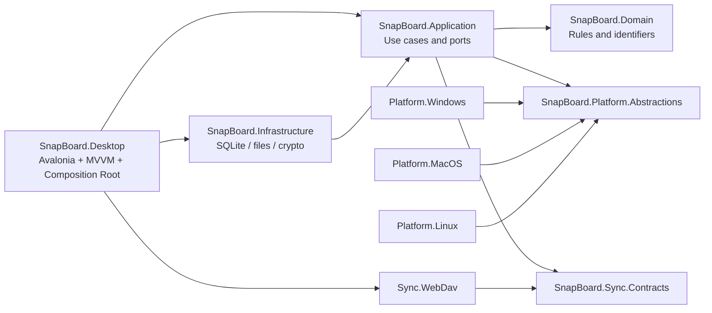
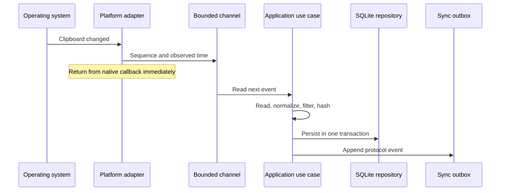

# SnapBoard 总体架构

> 状态：Phase 1.0 基线。边界已建立，具体用例会在后续阶段逐步填充。

## 1. 架构目标

架构优先保证四件事：原生平台差异可隔离、UI 不被 I/O 阻塞、Native AOT 可持续发布、同步协议不依赖特定 WebDAV 服务商。高内聚体现在每个程序集只负责一类变化，低耦合通过单向依赖和端口接口实现。

## 2. 程序集责任

| 项目 | 可以包含 | 禁止包含 |
| --- | --- | --- |
| Domain | 标识、值对象、领域规则 | Avalonia、SQL、HTTP、P/Invoke |
| Application | 用例、端口、流程协调 | 数据库 Provider、平台 API、窗口类型 |
| Infrastructure | SQLite、Blob、配置、加密实现 | UI 状态和平台消息循环 |
| Platform.Abstractions | 系统能力接口、能力等级 | 任一操作系统实现 |
| Platform.* | P/Invoke、权限、热键、剪贴板适配 | 历史去重、同步冲突、UI 业务规则 |
| Sync.Contracts | 协议 DTO、版本、JSON 源生成 | WebDAV 凭据、HTTP 客户端、领域服务 |
| Sync.WebDav | WebDAV 方法、ETag、路径与兼容检测 | 明文密钥、领域冲突规则、SQLite |
| Desktop | View、ViewModel、生命周期、DI 组合 | 直接 SQL、原生剪贴板实现、网络协议细节 |

## 3. 依赖规则

- Domain 只能引用 BCL。
- Application 可引用 Domain、Platform.Abstractions 和 Sync.Contracts。
- 实现层引用内层，内层永远不引用实现层。
- ViewModel 只调用 Application 用例，不直接创建 `SqliteConnection`、`HttpClient` 或原生句柄。
- 依赖注入在 Desktop 唯一组合根显式注册，不使用程序集扫描。
- 新的反向引用必须先修改架构文档和 ADR，并通过架构测试评审。

## 4. 剪贴板采集流程

关键限制：系统回调不读取大图片、不访问磁盘、不等待数据库；有界 Channel 提供背压；数据库写入保持单写者；UI 只接收增量结果。

## 5. 本地持久化

- Microsoft.Data.Sqlite 是唯一 Provider。
- 每次工作创建短生命周期连接，写事务经单写队列串行执行。
- WAL、外键、busy timeout 和必要 PRAGMA 在数据库初始化阶段统一配置。
- 大图片和大文本使用内容寻址 Blob，SQLite 保存元数据和相对路径。
- FTS5 索引与业务写事务保持一致；失败时不得留下正文存在但索引缺失的半状态。
- SQL 全部参数化，查询只投影当前视图需要的列。

## 6. AOT 约束

- Avalonia 使用编译绑定，不保留反射 ViewLocator。
- JSON 通过 `SyncJsonContext` 源生成。
- DI 使用显式注册。
- 不使用运行时 ORM、程序集扫描、动态代理和任意类型反序列化。
- 每个平台自己的 Runner 执行 Native AOT；任何未解释 IL2026、IL3050、IL3053 等告警均阻止发布。

## 7. 演进方式

平台能力和同步服务都通过接口增加实现，不通过条件语句渗透到 Domain。只有当两个以上实现出现真实重复且接口稳定时才抽象公共基类；在此之前优先保持小而明确的适配器。

## 8. 桌面生命周期与平台安全边界

Desktop 是窗口生命周期与依赖组合根，但不直接调用 AppKit、Carbon、CoreGraphics、Accessibility、Security.framework 或 ServiceManagement。`Platform.Abstractions` 定义单实例、状态菜单、全局快捷键、登录启动、辅助功能、平台主线程、启动上下文和密钥存储端口；`Platform.MacOS` 负责原生实现，Windows/Linux 继续使用各自适配器或显式不可用实现。

macOS 生命周期遵循以下约束：

- 首实例持有每用户非阻塞 `flock` 所有权锁和 Unix socket；锁负责进程所有权，socket 只发送有界命令并等待确认。即使首实例尚未开始接收命令，第二实例也不能删除活跃 socket 或启动第二套窗口、热键和剪贴板监听资源。
- Desktop 协调主/快速/设置窗口的按需创建和关闭释放；最后窗口关闭不退出，只有明确退出命令才按窗口、监听、热键、状态项、单实例和应用生命周期顺序释放。
- AppKit 对象创建、窗口定位、权限查询和状态菜单操作经 `IPlatformMainThreadDispatcher` 切换到 Avalonia UI 线程。跨托管/Objective-C 边界持有的状态项等对象显式 retain，并在移除后成对 release。
- 快速窗口打开前通过平台启动上下文保存目标应用；关闭不覆盖目标，粘贴完成后由自动粘贴服务恢复并二次校验目标，再发送 Command+V 或降级为手动粘贴。
- 快捷键设置只传递平台无关的修饰键和键名，UI 不接触 Carbon；平台服务负责映射、冲突检测、注册失败回滚、持久化和默认值恢复。
- 同步层后续只通过 `IPlatformSecretStore` 访问凭据。macOS 实现把二进制密钥保存在 Keychain，Infrastructure/Application 不依赖 Security.framework，也不存在明文配置回退。
