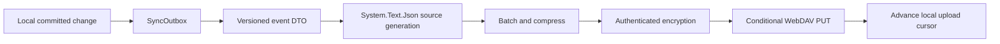

# SnapBoard WebDAV 同步协议

> 协议状态：v1 设计中。当前代码只有稳定类型、JSON 源生成和 WebDAV 配置边界，尚不能连接真实服务。

## 1. 设计原则

- 不同步 SQLite、WAL、缓存和本地索引文件。
- 每台设备只写自己的远端目录。
- 事件分片和 Blob 上传成功后不可修改。
- 服务端只保存密文，WebDAV 凭据不等于内容加密密钥。
- 客户端可离线工作，恢复后幂等合并。
- 首版同步 Text、HTML、RTF、Image，不同步文件本体。

## 2. 远端布局

```text
/SnapBoard/v1/<space-id>/
  space.json.enc
  devices/
    <device-id>/
      profile.json.enc
      events/
        <sequence>-<event-id>.segment.enc
      checkpoints/
        <sequence>.checkpoint.enc
  blobs/
    <prefix>/<keyed-content-hash>.blob.enc
```

`space-id` 和 `device-id` 不使用用户可读名称。Blob 名称使用密钥化内容哈希，避免服务端通过公开哈希猜测常见剪贴板内容。

## 3. WebDAV 操作

| 操作 | 用途 | 约束 |
| --- | --- | --- |
| MKCOL | 创建版本、设备和分片目录 | 已存在视为幂等成功 |
| PROPFIND Depth: 1 | 枚举设备和新对象 | 限制层级，避免全树扫描 |
| GET | 下载事件、Checkpoint 和 Blob | 校验长度、ETag、认证标签和哈希 |
| PUT + If-None-Match: * | 创建不可变对象 | 412 后重新枚举，禁止覆盖 |
| PUT + If-Match | 更新少量可变状态 | 必须持有最近 ETag |
| DELETE | 保守清理已确认对象 | 第一版默认不自动激进清理 |

协议不依赖 LOCK，因为不同 WebDAV 服务对锁的实现差异较大。正确性由设备独占目录、不可变对象和条件请求保证。

## 4. 本地到远端



Outbox 与业务写操作在同一 SQLite 事务提交。只有 WebDAV 条件 PUT 成功后才推进上传游标；超时但结果未知时先 PROPFIND/HEAD 确认，不能盲目覆盖。

## 5. 远端到本地

1. 枚举已知设备目录。
2. 从每台设备的本地游标之后查找新分片。
3. 下载到临时文件并限制最大长度。
4. 解密、验证认证标签、协议版本、DeviceId 和序列。
5. 解压并限制解压比，防止压缩炸弹。
6. 通过 `SyncJsonContext` 反序列化已登记 DTO。
7. 在 SQLite 事务中幂等应用并推进游标。
8. 事务完成后通知 UI。

## 6. JSON 契约

- 唯一实现是 System.Text.Json。
- DTO 使用 camelCase、明确版本和稳定枚举数值。
- 新增 DTO 必须加入 `SyncJsonContext` 的 `[JsonSerializable]`。
- 不使用 Newtonsoft.Json、动态类型、类型名元数据或运行时反射。
- 未知字段默认可忽略；未知必需语义通过协议版本拒绝。

## 7. 冲突规则

- 剪贴板新增是追加事件，EventId 保证幂等。
- 删除使用 Tombstone，不能物理删除本地记录后丢失删除意图。
- 置顶、标签和可变元数据使用逻辑版本与确定性 LWW；相同版本以 DeviceId 稳定排序。
- Blob 先于引用它的事件可见，缺失 Blob 的事件进入等待状态，不显示破损图片。
- Checkpoint 只优化新设备加入，不改变事件的最终真相。

## 8. 调度

- 本地变化后短延迟批量上传。
- 默认每 10 到 30 秒拉取，可由用户配置。
- 应用启动、系统唤醒、网络恢复和用户手动操作立即检查。
- WebDAV 没有统一推送，因此产品承诺“数秒到数十秒”同步，不宣传即时同步。

## 9. 兼容目标

优先验证 Nextcloud、Synology WebDAV Server 和 Apache mod_dav。服务端不提供可靠 ETag、条件写入或标准 PROPFIND 时，客户端必须显示具体诊断，不静默退化为覆盖写入。
